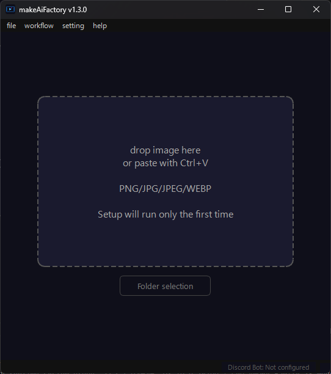

🌐 **Languages:** [日本語](README.md) | [English](README.en.md) | [中文](README.zh.md) | [한국어](README.ko.md)

---

# makeAiFactory

<p align="center">

</p>

<p align="center">
<a href="LICENSE"></a>
<a href="https://github.com/dikmri/makeAiFactory/releases/latest"></a>


</p>

> Turn your local PC into an AI video factory by simply dragging and dropping images.

<p align="center"></p>

**makeAiFactory** is an application that converts images into videos using AI.
You can automatically set up ComfyUI and Wan 2.2 models to generate high-quality AI videos without difficult settings.

---

## Features

- **Immediate generation by drag and drop/paste to clipboard** — Drop an image into the window or paste it with `Ctrl+V` to generate a video
- **Batch folder generation** — Specify a folder and convert multiple images into a video at once (cancellation midway)
- **Discord Bot Integration** — Set up and launch a bot that returns a video when you post an image to Discord from within the app
- **Internet input port β** — Issue a temporary public URL and allow people in remote locations to upload images from their browser (uses Cloudflare Quick Tunnel, no account required)
- **Multilingual support** — Japanese / English / Chinese / 한국어 can be switched within the app (automatically detects the OS language at startup)
- **Completely local processing** — Internet connection required for initial setup only. Generated data is not sent externally
- **Automatic setup** — The app automatically builds the Python environment, ComfyUI, and model.
- **Freely select the installation location** — Supports drives other than C drive
- **Model preset switching** — Select from 3 levels: normal / lightweight / ultra-lightweight according to your PC specifications
- **VRAM mode switching** — Equipped with a VRAM saving mode for environments with low VRAM
- **Speed-up (SageAttention)** — In supported environments, you can turn on/off the option to speed up generation.
- **CUDA automatic selection** — Detect GPU driver and automatically switch between cu128 / cu124 / cu121 / cu118
- **Automatic save/notification sound when completed** — Automatically save the completed video to the specified folder, play notification sound when completed (volume adjustable)
- **Always on top mode** — windows can be fixed so they are not hidden behind other windows
- **Auto Update** — Automatically detects, downloads and applies new versions

## Operating environment

| Item | Requirements |
|------|------|
| OS | Windows 10 / 11 (64bit) |
| GPU | NVIDIA GPU required (environments with only other companies' GPUs or built-in GPUs are not supported) |
| VRAM | 8 GB or more (16 GB or more recommended. For 8 to 16 GB, use of reduced VRAM mode is recommended) |
| RAM | 24 GB or more (varies depending on preset, see table below) |
| Storage | Approximately 55 GB or more free space (varies depending on model preset) |
| GPU driver | The latest version is recommended (even older drivers will automatically detect and support the CUDA version) |
| Internet | Required only for initial setup |

Recommended specs by model preset:

| Preset | Quality | VRAM guide | RAM guide |
|-----------|------|----------|---------|
| Normal mode | Best quality | ~14 GB | ~48 GB+ |
| Light Mode | High Quality | ~9 GB | ~32 GB+ |
| Ultralight mode | Standard quality | ~8 GB | ~24 GB+ |

> Compatible with a wide range of NVIDIA GPUs including RTX 3060 / 4060 / 5060 Ti. In environments with little VRAM, we recommend using ``Lightweight Mode'', ``Ultra Lightweight Mode'', or VRAM Saving Mode.

## install

1. Download the latest `makeAiFactory-vX.X.X-windows.zip` from the [Releases](../../releases/latest) page
2. Unzip to any folder
3. Run `makeAiFactory.exe`
4. Select the installation folder (e.g. `D:\makeAiFactory\runtime`)
5. Agree to the terms of use and start setup

**Initial setup takes several hours** (mainly involves downloading the model).
Once the setup is complete, it will start up in a few seconds the next time.

## How to use

1. Launch the app and wait until setup is complete
2. Drag and drop the image into the app window (or paste with `Ctrl+V`)
3. Video generation will start automatically (about a few minutes to 20 minutes, depending on PC specs and settings)
4. After the generation is complete, the preview will be played in a loop.
5. Save MP4 to your favorite location using “Save As”

If you want to process multiple images at once, you can also use batch generation by specifying a folder.

## Settings menu

You can change the following items from **Settings** on the menu bar.

- Change the installation location (requires restarting the app after changing)
- Setting and enabling automatic save destination folder
- Always on top
- Model presets (normal/light/ultralight)
- VRAM mode (normal/ultra-saving VRAM)
- Enabling acceleration (SageAttention)
- Completion notification sound (sound/not sound, when creating folder, volume)
- Language switching (Japanese / English / Chinese / 한국어)
- **Discord Bot settings** (described later)
- **Internet input port β** (described later)

---

## Discord Bot integration

You can use a PC running makeAiFactory as a "video generation server" and set up a bot that returns videos when you send images via Discord.

> **Note:** The makeAiFactory app must be running to run the bot.

### Step 1 — Create a Discord Bot

1. Open [Discord Developer Portal](https://discord.com/developers/applications) in your browser
2. Click **“New Application”** at the top right → enter a name (e.g. `makeAiFactory`) to create it
3. Click **“Bot”** on the left menu
4. **"Reset Token"** → **"Yes, do it!"** → Copy and paste the displayed token into Notepad and save it.
⚠️ This token will never be seen again. Please keep it carefully
5. At the bottom of the page, in the **Privileged Gateway Intents** section,
Turn on **MESSAGE CONTENT INTENT** and save

### Step 2 — Invite the bot to your server

1. Click **"OAuth2"** → **"URL Generator"** on the left menu
2. Check `bot` in **"Scopes"**
3. Check the following in **"Bot Permissions"** that appears below.
- `Send Messages`
- `Attach Files`
- `Read Message History`
4. Copy the URL at the bottom and open it in your browser
5. Select the server you want to invite and click **Authenticate** → The bot will join the server.

### Step 3 — Get the channel ID (optional)

If you don't specify a channel, the bot will monitor all channels.
If you want to use only a specific channel, follow the steps below to get the ID.

1. Discord Settings → Advanced Settings → Turn on **“Developer Mode”**
2. **Right-click** the channel you want to use the bot on
3. Click **"Copy channel ID"** (you will get a long number)

If you want to specify multiple channels, repeat the same steps and note the IDs.

### Step 4 — Set up in the app

1. Start makeAiFactory and wait until setup is complete
2. Click **Settings → Discord Bot Settings...** on the menu bar.
3. Check **“Enable Discord Bot”**
4. Paste the token you noted in step 1 into **“Bot Token”**
5. Enter the obtained ID in **“Monitoring Channel ID”** (separate with a comma if there are multiple IDs. Leave blank to monitor all channels)
6. Click **Save and Apply**
7. If ``Connection Completed'' is displayed in the ``Bot Status'' dialog box, you are done!

### How to use

- If you **post an image** to a target channel on Discord with the bot enabled, you will receive an **MP4 video reply** after a while.
- App administrators can cancel video generation on the spot with the **"Suspend" button**
- Requests from Discord will be automatically declined while folders are being generated in bulk (reply will be "Unable to accept because folders are being generated")

---

## Internet input port β (remote upload)

This is a feature that allows you to issue a temporary public URL and have someone in a remote location upload an image and receive the generated video without using Discord. Cloudflare Quick Tunnel is used, so a Cloudflare account is not required.

### How to use

1. Click **"Settings" → "Internet Input Slot β..."** on the menu bar.
2. Select the public settings (expiration date, authentication method, maximum number of queues, limit on consecutive submissions per person) and click **"Start input slot"**
3. Share the issued URL and QR code (with PIN) with the person you want to send the image to.
4. When the other person accesses it with a browser and uploads an image, a video will be generated and available for download.
5. When it is no longer needed, end publishing by clicking **"Stop input slot"** (connected users will be disconnected and the URL will become invalid).

### Public settings

| Item | Choice |
|------|--------|
| Expiration date | 1 hour / 3 hours (recommended) / 6 hours |
| Authentication method | QR code + PIN (recommended) / QR code only |
| Maximum number of waiting items | 1 item / 3 items / 5 items |
| Consecutive pitching limit (per person) | 5 minutes / 10 minutes (recommended) / 30 minutes |

### Safety features

During operation, you can check the status of "Waiting / Generating / Completed / Failed" in real time. In an emergency, you can perform the following operations.

- **Stop accepting** — Reject only new uploads (jobs in progress will continue)
- **Cancel generation** — Cancel the running generation on the spot
- **Clear Queue** — Delete all waiting jobs

---

## For developers

### Required environment

-Python 3.13
- Git
- [uv](https://github.com/astral-sh/uv)

### set up

```bash
git clone https://github.com/dikmri/makeAiFactory.git
cd makeAiFactory
uv sync
```

Dependencies (PySide6, httpx, discord.py, aiohttp, qrcode, etc.) are automatically installed from `pyproject.toml` / `uv.lock`.

### EXE build

```bash
uv run pyinstaller makeAiFactory.spec --noconfirm
```

Build artifacts are output to `dist\makeAiFactory\`.

### Regenerate icon

```bash
uv run python tools\create_icon.py
```

`assets\icon.ico` and `assets\icon.png` (for README) will be generated.

### release

Create and push Git tags and GitHub Actions will automatically build and release them.

```bash
git tag v1.3.0
git push origin v1.3.0
```

---

## OSS library used

| Library | License |
|-----------|-----------|
| [ComfyUI](https://github.com/comfyanonymous/ComfyUI) | GPL-3.0 |
| [Wan 2.2 model](https://huggingface.co/Wan-AI) | Apache-2.0 |
| [PyTorch](https://pytorch.org/) | BSD-3-Clause |
| [PySide6](https://wiki.qt.io/Qt_for_Python) | LGPL-3.0 |
| [uv](https://github.com/astral-sh/uv) | MIT / Apache-2.0 |
| [VideoHelperSuite](https://github.com/Kosinkadink/ComfyUI-VideoHelperSuite) | GPL-3.0 |
| [discord.py](https://github.com/Rapptz/discord.py) | MIT |
| [aiohttp](https://github.com/aio-libs/aiohttp) | Apache-2.0 |
| [qrcode](https://github.com/lincolnloop/python-qrcode) | BSD |
| [cloudflared](https://github.com/cloudflare/cloudflared) | Apache-2.0 (separate automatic download with Internet input beta function) |

## License

MIT License — See [LICENSE](LICENSE) for details.

---

## Disclaimer

- All responsibility for the use and publication of generated content belongs to the user.
- Prohibits the generation of sexual content or content aimed at minors without the consent of a real person
- This app is provided "as is" and the developer is not responsible for any damages resulting from it.
