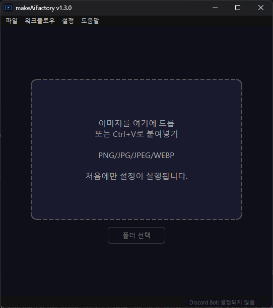

🌐 **Languages:** [日本語](README.md) | [English](README.en.md) | [中文](README.zh.md) | [한국어](README.ko.md)

---

# makeAiFactory

<p align="center">

</p>

<p align="center">
<a href="LICENSE"></a>
<a href="https://github.com/dikmri/makeAiFactory/releases/latest"></a>


</p>

> 이미지를 드래그 앤 드롭하는 것만으로 로컬 PC가 AI 동영상 공장으로 바뀐다.

<p align="center"></p>

**makeAiFactory**는 AI에서 이미지를 동영상으로 변환하는 애플리케이션입니다.
ComfyUI 및 Wan 2.2 모델을 자동으로 설정하여 어려운 설정 없이 고품질 AI 동영상을 생성할 수 있습니다.

---

## 특징

- **드래그 앤 드롭/클립보드 붙여넣기로 즉시 생성** — 이미지를 창에 드롭하거나 `Ctrl+V`로 붙여넣어 동영상 생성
- **폴더 일괄 생성** — 폴더를 지정하여 여러 장의 이미지를 정리하여 동영상화(도중 취소 가능)
- **Discord Bot 연계** — Discord에 이미지를 올리면 동영상이 돌아오는 Bot을 앱 내에서 설정·기동
- **인터넷 입구 β** — 임시 공개 URL을 발행하여 원격 위치에 있는 사용자에게도 브라우저에서 이미지를 업로드할 수 있습니다(Cloudflare Quick Tunnel 사용, 계정 필요 없음).
- **다국어 대응** — 일본어/English/중문/한국어를 앱 내에서 전환 가능(기동시에는 OS의 언어를 자동 검출)
- **완전 로컬 프로세싱** — 인터넷 연결은 초기 설정만. 생성 데이터는 외부로 전송되지 않습니다.
- **자동 설정** — Python 환경, ComfyUI, 모델 구축을 앱이 자동으로 수행합니다.
- **설치처를 자유롭게 선택** — C드라이브 이외의 드라이브에도 대응
- **모델 프리셋 전환** — 일반/경량/초경량의 3단계에서 PC 스펙에 맞게 선택
- **VRAM 모드 전환** — VRAM이 적은 환경용 절전 VRAM 모드를 탑재
- **고속화(SageAttention)** — 대응 환경에서는 생성을 고속화하는 옵션을 ON/OFF 가능
- **CUDA 자동 선택** — GPU 드라이버를 감지하고 cu128 / cu124 / cu121 / cu118을 자동으로 전환합니다.
- **완성시의 자동 보존·통지음** — 완성한 동영상을 지정 폴더에 자동 보존, 완성시에 통지음을 재생(음량 조정 가능)
- **항상 최전면 표시 모드** — 윈도우가 다른 윈도우의 뒤에 숨기지 않도록 고정 가능
- **자동 업데이트** — 새 버전을 자동 감지하여 다운로드 및 적용합니다.

## 운영 환경

| 항목 | 요구 사항 |
|------|------|
| OS | Windows 10 / 11 (64bit) |
| GPU | NVIDIA GPU 필수(타사 GPU·내장 GPU만의 환경은 비대응) |
| VRAM | 8GB 이상(16GB 이상 권장, 8~16GB의 경우 절전 VRAM 모드 사용 권장) |
| RAM | 24GB 이상 (프리셋에 따라 다름. 아래 표 참조) |
| 스토리지 | 약 55GB 이상의 여유 공간(모델 사전 설정에 따라 변동) |
| GPU 드라이버 | 최신 버전 권장 (이전 드라이버에서도 CUDA 버전을 자동으로 판별하고 대응합니다) |
| 인터넷 | 초기 설정 시에만 필요 |

모델 프리셋별 권장 사양:

| 프리셋 | 품질 | VRAM 기준 | RAM 기준 |
|-----------|------|----------|---------|
| 일반 모드 | 최고 품질 | ~14 GB | ~48 GB+ |
경량 모드 | 고품질 | ~9 GB | ~32 GB+ |
초경량 모드 | 표준 품질 | ~8 GB | ~24 GB+ |

> RTX 3060 / 4060 / 5060 Ti 등 폭넓은 NVIDIA GPU를 지원합니다. VRAM이 적은 환경에서는 「경량 모드」 「초경량 모드」나 절전 VRAM 모드의 이용을 추천합니다.

## 설치

1. [Releases](../../releases/latest) 페이지에서 최신 `makeAiFactory-vX.X.X-windows.zip` 다운로드
2. 임의의 폴더로 압축 해제
3. `makeAiFactory.exe` 실행
4. 대상 폴더를 선택합니다(예: `D:\makeAiFactory\runtime`)
5. 이용 약관에 동의하여 설정 시작

**초기 설정은 몇 시간이 걸립니다**(모델 다운로드가 중심입니다).
설치가 완료되면 다음 번부터 몇 초 안에 시작됩니다.

## 사용법

1. 앱을 시작하고 설정이 완료될 때까지 기다립니다.
2. 이미지를 앱 창에 드래그 앤 드롭(또는 `Ctrl+V`로 붙여넣기)
3. 동영상 생성이 자동으로 시작된다(수분~20분 정도, PC 스펙이나 설정에 따라 변동)
4. 생성 완료 후 미리보기가 반복 재생됩니다.
5. "다른 이름으로 저장"에서 원하는 곳에 MP4 저장

여러 장을 정리하여 처리하고 싶은 경우는 폴더 지정에서의 일괄 생성도 이용할 수 있습니다.

## 설정 메뉴

메뉴바의 **설정**에서 다음 항목을 변경할 수 있습니다.

- 설치 위치 변경(변경 후 앱을 다시 시작해야 함)
- 자동 저장 대상 폴더 설정 및 활성화
- 항상 맨 앞에 표시
- 모델 프리셋 (일반 / 경량 / 초경량)
- VRAM 모드 (일반 / 초성 VRAM)
- 가속화(SageAttention) 활성화
- 완성 통지음
- 언어 전환 (일본어 / English / 중문 / 한국어)
- **Discord Bot 설정**(후술)
- **인터넷 투입구 β**(후술)

---

## Discord Bot 연계

makeAiFactory 가 기동하고 있는 PC 를 「동영상 생성 서버」로서 사용해, Discord 로 화상을 보내면 동영상이 돌아오는 Bot 를 설정할 수 있습니다.

> **주의 : ** Bot을 이동하려면 makeAiFactory 앱이 실행 중이어야합니다.

### 1단계 — Discord Bot 만들기

1. 브라우저에서 Discord Developer Portal(https://discord.com/developers/applications) 열기
2. 오른쪽 상단의 **New Application**을 클릭 → 이름을 입력(예: `makeAiFactory`)하여 작성
3. 왼쪽 메뉴에서 **Bot**을 클릭합니다.
4. **“Reset Token”** → **“Yes, do it!”** → 표시된 토큰을 복사하여 메모장에 붙여넣고 저장
⚠️ 이 토큰은 다시 표시되지 않습니다. 소중히 보관하십시오
5. 이 페이지 아래쪽의 **Privileged Gateway Intents** 섹션에서
** "MESSAGE CONTENT INTENT"**를 켜고 저장

### 2단계 — Bot을 서버에 초대하기

1. 왼쪽 메뉴에서 **OAuth2** → **URL Generator**를 클릭합니다.
2. ** "Scopes"**에서 `bot`을 체크하십시오.
3. 아래에 나타난 **Bot Permissions**에서 아래에 체크를 넣는다
- `Send Messages`
- `Attach Files`
- `Read Message History`
4. 하단 URL을 복사하여 브라우저에서 열기
5. 초대할 서버를 선택하고 **인증** → Bot이 서버에 가입합니다.

### 3단계 — 채널 ID 가져오기(선택사항)

채널을 지정하지 않으면 Bot은 모든 채널을 모니터링합니다.
특정 채널만 사용하려면 다음 단계를 따라 ID를 가져옵니다.

1. Discord 설정 → 고급 설정 → ** "개발자 모드"**를 켭니다.
2. Bot을 사용하고 싶은 채널을 **오른쪽 클릭**
3. ** "채널 ID 복사"**를 클릭 (긴 숫자를 얻을 수 있음)

여러 채널을 지정하려면 동일한 절차를 반복하여 ID를 기록해 둡니다.

### 4단계 — 앱에서 설정

1. makeAiFactory를 시작하고 설정이 완료 될 때까지 기다립니다.
2. 메뉴 바에서 **설정→Discord Bot 설정...**을 클릭합니다.
3. ** "Discord Bot 사용"**을 선택합니다.
4. **Bot Token**에 1단계에서 기록한 토큰 붙여넣기
5. **「감시 채널 ID」**에 취득한 ID를 입력한다(복수의 경우는 콤마로 단락짓는다.공란에서 모든 채널 감시)
6. **저장 및 적용**을 클릭합니다.
7. 다이얼로그의 「Bot 상태」에 **「연결 완료」** 라고 표시되면 완료!

### 사용법

- Bot이 활성화된 상태에서 Discord 대상 채널에 **이미지를 게시**하면 잠시 후 **MP4 동영상이 회신**됩니다.
- 앱 관리자는 **'중단' 버튼**으로 동영상 생성을 그 자리에서 취소할 수 있습니다.
- 폴더 일괄 생성 중에는 Discord의 요청이 자동으로 거절됩니다 ( "폴더 생성 중이므로 수락되지 않습니다"라고 회신됩니다)

---

## 인터넷 투입구 β(원격 업로드)

Discord를 사용하지 않고 임시 공개 URL을 발행하여 원격 위치에 있는 사용자에게 이미지를 업로드하고 생성한 동영상을 받게 하는 기능입니다. Cloudflare Quick Tunnel을 사용하기 때문에 Cloudflare 계정이 필요하지 않습니다.

### 사용법

1. 메뉴바의 **「설정」→「인터넷 투입구 β...」** 를 클릭
2. 공개 설정(유효 기한·인증 방식·최대 대기 건수·1인당 연투 제한)을 선택하고 **「투입구 시작」** 을 클릭
3. 발행된 URL과 QR코드(PIN 첨부)를 이미지를 보내고 싶은 상대에게 공유
4. 상대방이 브라우저에서 액세스하여 이미지를 업로드하면 동영상이 생성되어 다운로드할 수 있습니다.
5. 더 이상 필요하지 않으면 ** '입구 중지'**에서 게시를 종료합니다.

### 공개 설정

| 항목 | 선택 |
|------|--------|
| 만료일 | 1시간 / 3시간 (권장) / 6시간 |
| 인증 방법 | QR 코드 + PIN(권장) / QR 코드만 |
| 최대 대기 건수 | 1건 / 3건 / 5건 |
|연투제한(1인당) |5분/10분(권장)/30분 |

### 안전 기능

실행 중에는 실시간으로 "대기 / 생성 중 / 완료 / 실패"상태를 확인할 수 있습니다. 긴급시에는 다음의 조작이 가능합니다.

- **접수 중지** — 새 업로드만 거부(처리 중인 작업은 계속됨)
- **생성을 중단** — 실행중의 생성을 그 자리에서 취소
- **큐 지우기** — 대기 중인 모든 작업 삭제

---

## 개발자용

### 필수 환경

- 파이썬 3.13
- Git
- [uv](https://github.com/astral-sh/uv)

### 설정

```bash
git clone https://github.com/dikmri/makeAiFactory.git
cd makeAiFactory
uv sync
```

종속성(PySide6, httpx, discord.py, aiohttp, qrcode 등)은 `pyproject.toml` / `uv.lock`에서 자동으로 설치됩니다.

### EXE 빌드

```bash
uv run pyinstaller makeAiFactory.spec --noconfirm
```

빌드 아티팩트는 `dist\makeAiFactory\`에 출력됩니다.

### 아이콘 재생성

```bash
uv run python tools\create_icon.py
```

`assets\icon.ico` 와 `assets\icon.png` (README 용)이 생성됩니다.

### 출시

Git 태그를 만들고 푸시하면 GitHub Actions가 자동으로 빌드 및 릴리스됩니다.

```bash
git tag v1.3.0
git push origin v1.3.0
```

---

## 사용중인 OSS 라이브러리

| 라이브러리 | 라이센스 |
|-----------|-----------|
| [ComfyUI](https://github.com/comfyanonymous/ComfyUI) | GPL-3.0 |
| [Wan 2.2 모델](https://huggingface.co/Wan-AI) | Apache-2.0 |
| [PyTorch](https://pytorch.org/) | BSD-3-Clause |
| [PySide6](https://wiki.qt.io/Qt_for_Python) | LGPL-3.0 |
| [uv](https://github.com/astral-sh/uv) | MIT / Apache-2.0 |
| [VideoHelperSuite](https://github.com/Kosinkadink/ComfyUI-VideoHelperSuite) | GPL-3.0 |
| [discord.py](https://github.com/Rapptz/discord.py) | MIT |
| [aiohttp](https://github.com/aio-libs/aiohttp) | Apache-2.0 |
| [qrcode](https://github.com/lincolnloop/python-qrcode) | BSD |
| [cloudflared](https://github.com/cloudflare/cloudflared) | Apache-2.0(인터넷 투입구 베타 기능으로 별도 자동 다운로드) |

## 라이센스

MIT License — 자세한 내용은 [LICENSE](LICENSE)를 참조하세요.

---

## 면책 조항

- 생성 컨텐츠의 이용·공개에 관한 책임은 모두 유저에게 귀속합니다
- 실재하는 인물의 동의 없는 성적 콘텐츠나 미성년을 대상으로 한 콘텐츠의 생성을 금지합니다.
- 본 앱은 '있는 그대로' 제공되며 개발자는 생성 결과로 인한 손해에 대해 책임을지지 않습니다.
