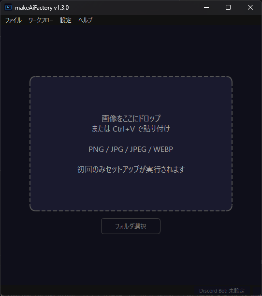

🌐 **Languages:** [日本語](README.md) | [English](README.en.md) | [中文](README.zh.md) | [한국어](README.ko.md)

---

# makeAiFactory

<p align="center">
  
</p>

<p align="center">
  <a href="LICENSE"></a>
  <a href="https://github.com/dikmri/makeAiFactory/releases/latest"></a>
  
  
</p>

> 画像をドラッグ＆ドロップするだけで、ローカルPCがAI動画工場に変わる。

<p align="center"></p>

**makeAiFactory** は、AIで画像を動画に変換するアプリケーションです。  
ComfyUI と Wan 2.2 モデルを自動でセットアップし、難しい設定なしに高品質なAI動画を生成できます。  

---

## 特徴

- **ドラッグ＆ドロップ／クリップボード貼り付けで即生成** — 画像をウィンドウにドロップ、または `Ctrl+V` で貼り付けて動画生成
- **フォルダ一括生成** — フォルダを指定して複数枚の画像をまとめて動画化（途中キャンセル可）
- **Discord Bot 連携** — Discord に画像を投稿すると動画が返ってくる Bot をアプリ内から設定・起動
- **インターネット投入口 β** — 一時的な公開URLを発行し、離れた場所にいる人にもブラウザから画像をアップロードしてもらえます（Cloudflare Quick Tunnel 使用、アカウント不要）
- **多言語対応** — 日本語 / English / 中文 / 한국어 をアプリ内で切り替え可能（起動時はOSの言語を自動検出）
- **通常はローカル処理で完結** — 通常のローカル生成では、入力画像・生成データは外部に送信されません（Discord Bot・インターネット投入口・自動更新など任意機能の利用時はその機能に応じて通信します）
- **自動セットアップ** — Python 環境・ComfyUI・モデルの構築をアプリが自動で行います
- **インストール先を自由に選択** — Cドライブ以外のドライブにも対応
- **モデルプリセット切り替え** — 通常 / 軽量 / 超軽量の3段階からお使いのPCスペックに合わせて選択
- **VRAMモード切り替え** — VRAMが少ない環境向けの省VRAMモードを搭載
- **高速化 (SageAttention)** — 対応環境では生成を高速化するオプションを ON/OFF 可能
- **CUDA 自動選択** — GPU ドライバーを検出し cu128 / cu124 / cu121 / cu118 を自動で切り替えます
- **完成時の自動保存・通知音** — 完成した動画を指定フォルダへ自動保存、完成時に通知音を再生（音量調整可）
- **常に最前面表示モード** — ウィンドウが他のウィンドウの裏に隠れないように固定可能
- **自動更新** — 新バージョンを自動検出してダウンロード・適用します

## 動作環境

| 項目 | 要件 |
|------|------|
| OS | Windows 10 / 11 (64bit) |
| GPU | NVIDIA GPU 必須（他社GPU・内蔵GPUのみの環境は非対応） |
| VRAM | 8 GB 以上（16 GB 以上推奨。8〜16GB の場合は省VRAMモードの利用を推奨） |
| RAM | 24 GB 以上（プリセットにより異なる。下表参照） |
| ストレージ | 約 55 GB 以上の空き容量（モデルプリセットにより変動） |
| GPUドライバー | 最新版を推奨（古いドライバーでも CUDA バージョンを自動判別し対応します） |
| インターネット | 初回セットアップ時に必要（Discord Bot・インターネット投入口・自動更新など任意機能を使う場合は追加で通信） |

モデルプリセット別の推奨スペック:

| プリセット | 品質 | VRAM目安 | RAM目安 |
|-----------|------|----------|---------|
| 通常モード | 最高品質 | ~14 GB | ~48 GB+ |
| 軽量モード | 高品質 | ~9 GB | ~32 GB+ |
| 超軽量モード | 標準品質 | ~8 GB | ~24 GB+ |

> RTX 3060 / 4060 / 5060 Ti など幅広い NVIDIA GPU に対応しています。VRAMが少ない環境では「軽量モード」「超軽量モード」や省VRAMモードの利用をおすすめします。

## インストール

1. [Releases](../../releases/latest) ページから最新の `makeAiFactory-vX.X.X-windows.zip` をダウンロード
2. 任意のフォルダに解凍
3. `makeAiFactory.exe` を実行
4. インストール先フォルダを選択（例: `D:\makeAiFactory\runtime`）
5. 利用規約に同意してセットアップを開始

**初回セットアップは数時間かかります**（モデルのダウンロードが中心です）。  
セットアップが完了すると、次回からは数秒で起動します。

## 使い方

1. アプリを起動してセットアップが完了するまで待つ
2. 画像をアプリウィンドウにドラッグ＆ドロップ（または `Ctrl+V` で貼り付け）
3. 動画生成が自動で始まる（数分〜20分程度、PCスペックや設定により変動）
4. 生成完了後、プレビューがループ再生される
5. 「名前を付けて保存」で好きな場所に MP4 を保存

複数枚をまとめて処理したい場合は、フォルダ指定での一括生成も利用できます。

## 設定メニュー

メニューバーの **設定** から、以下の項目を変更できます。

- インストール場所の変更（変更後はアプリの再起動が必要）
- 自動保存先フォルダの設定・有効化
- 常に最前面に表示
- モデルプリセット（通常 / 軽量 / 超軽量）
- VRAMモード（通常 / 超省VRAM）
- 高速化 (SageAttention) の有効化
- 完成通知音（鳴らす/鳴らさない、フォルダ生成時、音量）
- 言語切替（日本語 / English / 中文 / 한국어）
- **Discord Bot 設定**（後述）
- **インターネット投入口 β**（後述）

---

## Discord Bot 連携

makeAiFactory が起動している PC を「動画生成サーバー」として使い、Discord で画像を送ると動画が返ってくる Bot を設定できます。

> **注意:** Bot を動かすには makeAiFactory のアプリが起動していることが必要です。

### ステップ 1 — Discord Bot を作る

1. [Discord Developer Portal](https://discord.com/developers/applications) をブラウザで開く
2. 右上の **「New Application」** をクリック → 名前を入力（例: `makeAiFactory`）して作成
3. 左メニューの **「Bot」** をクリック
4. **「Reset Token」** → **「Yes, do it!」** → 表示されたトークンをコピーしてメモ帳に貼り付けて保存  
   ⚠️ このトークンは二度と表示されません。大切に保管してください
5. 同ページの下のほうにある **「Privileged Gateway Intents」** セクションで  
   **「MESSAGE CONTENT INTENT」** をオンにして保存

### ステップ 2 — Bot をサーバーに招待する

1. 左メニューの **「OAuth2」** → **「URL Generator」** をクリック
2. **「Scopes」** で `bot` にチェックを入れる
3. 下に現れた **「Bot Permissions」** で以下にチェックを入れる
   - `Send Messages`
   - `Attach Files`
   - `Read Message History`
4. 一番下の URL をコピーしてブラウザで開く
5. 招待するサーバーを選んで **「認証」** → Bot がサーバーに参加します

### ステップ 3 — チャンネル ID を取得する（省略可）

チャンネルを指定しない場合、Bot はすべてのチャンネルを監視します。  
特定のチャンネルだけにしたい場合は以下の手順で ID を取得します。

1. Discord の設定 → 詳細設定 → **「開発者モード」** をオンにする
2. Bot を使わせたいチャンネルを**右クリック**
3. **「チャンネルIDをコピー」** をクリック（長い数字が取得できます）

複数のチャンネルを指定したい場合は、同じ手順を繰り返して ID をメモします。

### ステップ 4 — アプリで設定する

1. makeAiFactory を起動し、セットアップが完了するまで待つ
2. メニューバーの **「設定」→「Discord Bot 設定...」** をクリック
3. **「Discord Bot を有効にする」** にチェックを入れる
4. **「Bot トークン」** にステップ 1 でメモしたトークンを貼り付ける
5. **「監視チャンネルID」** に取得した ID を入力する（複数の場合はカンマで区切る。空欄で全チャンネル監視）
6. **「保存して適用」** をクリック
7. ダイアログの「Bot 状態」に **「接続完了」** と表示されれば完了！

### 使い方

- Bot が有効な状態で Discord の対象チャンネルに **画像を投稿** すると、しばらくして **MP4 動画が返信** されます
- アプリ管理者は **「中断」ボタン**で動画生成をその場でキャンセルできます
- フォルダ一括生成中は Discord からのリクエストは自動的に断られます（「フォルダ生成中のため受け付けられません」と返信されます）

---

## インターネット投入口 β（リモートアップロード）

Discord を使わずに、一時的な公開URLを発行して離れた場所にいる人に画像をアップロードしてもらい、生成した動画を受け取ってもらう機能です。Cloudflare Quick Tunnel を使用するため、Cloudflareアカウントは不要です。

### 使い方

1. メニューバーの **「設定」→「インターネット投入口 β...」** をクリック
2. 公開設定（有効期限・認証方式・最大待ち件数・1人あたりの連投制限）を選んで **「投入口を開始」** をクリック
3. 発行された URL と QRコード（PIN付き）を、画像を送ってほしい相手に共有
4. 相手がブラウザでアクセスして画像をアップロードすると、動画が生成されダウンロードできるようになります
5. 不要になったら **「投入口を停止」** で公開を終了（接続中のユーザーは切断され、URL は無効になります）

### 公開設定

| 項目 | 選択肢 |
|------|--------|
| 有効期限 | 1時間 / 3時間（推奨） / 6時間 |
| 認証方式 | QRコード + PIN（推奨） / QRコードのみ |
| 最大待ち件数 | 1件 / 3件 / 5件 |
| 連投制限（1人あたり） | 5分 / 10分（推奨） / 30分 |

### 安全機能

稼働中はリアルタイムで「待機 / 生成中 / 完了 / 失敗」の状況を確認できます。緊急時は以下の操作が可能です。

- **受付停止** — 新しいアップロードのみ拒否（処理中のジョブは継続）
- **生成を中断** — 実行中の生成をその場でキャンセル
- **キューを消去** — 待機中のジョブをすべて削除

---

## 開発者向け

### 必要環境

- Python 3.13
- Git
- [uv](https://github.com/astral-sh/uv)

### セットアップ

```bash
git clone https://github.com/dikmri/makeAiFactory.git
cd makeAiFactory
uv sync
```

依存関係（PySide6, httpx, discord.py, aiohttp, qrcode 等）は `pyproject.toml` / `uv.lock` から自動でインストールされます。

### EXE ビルド

```bash
uv run pyinstaller makeAiFactory.spec --noconfirm
```

ビルド成果物は `dist\makeAiFactory\` に出力されます。

### アイコン再生成

```bash
uv run python tools\create_icon.py
```

`assets\icon.ico` と `assets\icon.png`（README用）が生成されます。

### リリース

Git タグを作成してプッシュすると GitHub Actions が自動でビルド・リリースします。

```bash
git tag v1.3.0
git push origin v1.3.0
```

---

## 使用しているOSSライブラリ

| ライブラリ | ライセンス |
|-----------|-----------|
| [ComfyUI](https://github.com/comfyanonymous/ComfyUI) | GPL-3.0 |
| [Wan 2.2 モデル](https://huggingface.co/Wan-AI) | Apache-2.0 |
| [PyTorch](https://pytorch.org/) | BSD-3-Clause |
| [PySide6](https://wiki.qt.io/Qt_for_Python) | LGPL-3.0 |
| [uv](https://github.com/astral-sh/uv) | MIT / Apache-2.0 |
| [VideoHelperSuite](https://github.com/Kosinkadink/ComfyUI-VideoHelperSuite) | GPL-3.0 |
| [discord.py](https://github.com/Rapptz/discord.py) | MIT |
| [aiohttp](https://github.com/aio-libs/aiohttp) | Apache-2.0 |
| [qrcode](https://github.com/lincolnloop/python-qrcode) | BSD |
| [cloudflared](https://github.com/cloudflare/cloudflared) | Apache-2.0（インターネット投入口β機能で別途自動ダウンロード） |

## ライセンス

MIT License — 詳細は [LICENSE](LICENSE) をご覧ください。

---

## 免責事項

- 生成コンテンツの利用・公開に関する責任はすべてユーザーに帰属します
- 実在する人物の同意なき性的コンテンツや、未成年を対象としたコンテンツの生成を禁じます
- 本アプリは「現状のまま」提供され、開発者は生成結果による損害に責任を負いません
