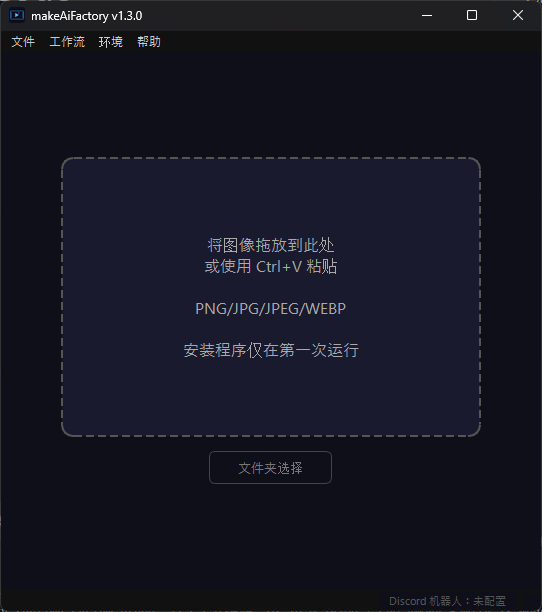

🌐 **Languages:** [日本語](README.md) | [English](README.en.md) | [中文](README.zh.md) | [한국어](README.ko.md)

---

# makeAiFactory

<p对齐=“中心”>

</p>

<p对齐=“中心”>
<a href="LICENSE"></a>
<a href="https://github.com/dikmri/makeAiFactory/releases/latest"></a>


</p>

> 只需拖放图像，即可将本地 PC 变成 AI 视频工厂。

<p align="center"></p>

**makeAiFactory**是一款使用人工智能将图像转换为视频的应用程序。
您可以自动设置ComfyUI和Wan 2.2模型来生成高质量的AI视频，无需进行困难的设置。

---

＃＃ 特征

- **通过拖放/粘贴到剪贴板立即生成** — 将图像拖放到窗口中或使用“Ctrl+V”粘贴以生成视频
- **批量文件夹生成** — 指定文件夹并一次将多张图片转换为视频（中途取消）
- **Discord 机器人集成** — 设置并启动一个机器人，当您从应用程序内将图像发布到 Discord 时，该机器人会返回视频
- **互联网输入端口 β** — 发布临时公共 URL，并允许远程位置的人们从浏览器上传图像（使用 Cloudflare Quick Tunnel，无需帐户）
- **多语言支持** — 日文/英文/中文/한국어可在应用程序内切换（启动时自动检测操作系统语言）
- **完全本地处理** — 仅初始设置需要互联网连接。生成的数据不向外发送
- **自动设置** — 应用程序自动构建 Python 环境、ComfyUI 和模型。
- **自由选择安装位置** — 支持C盘以外的驱动器
- **模型预设切换** — 根据您的电脑规格从 3 个级别中选择：普通/轻量级/超轻量级
- **VRAM 模式切换** — 配备 VRAM 节省模式，适用于低 VRAM 环境
- **加速 (SageAttention)** — 在支持的环境中，您可以打开/关闭选项以加速生成。
- **CUDA自动选择** — 检测GPU驱动并自动在cu128 / cu124 / cu121 / cu118之间切换
- **完成时自动保存/通知声音** — 自动将完成的视频保存到指定文件夹，完成时播放通知声音（音量可调）
- **始终在顶部模式** - 窗口可以固定，这样它们就不会隐藏在其他窗口后面
- **自动更新** — 自动检测、下载并应用新版本

## 运行环境

|项目 |要求|
|------|------|
|操作系统 | Windows 10 / 11（64 位）|
|图形处理器 |需要NVIDIA GPU（不支持只有其他公司的GPU或内置GPU的环境）|
|显存 | 8 GB 或更多（建议 16 GB 或更多。对于 8 至 16 GB，建议使用缩减 VRAM 模式）|
|内存 | 24 GB 或更多（根据预设而有所不同，请参见下表）|
|存储|大约 55 GB 或更多可用空间（根据型号预设而有所不同）|
| GPU驱动程序|推荐最新版本（即使是较旧的驱动也会自动检测并支持CUDA版本）|
|互联网|仅初始设置需要 |

按型号预设推荐规格：

|预设|品质 |显存指南 |内存指南 |
|-----------|------|----------|---------|
|普通模式|最好的品质 | 〜14 GB | ~48 GB+ |
|灯光模式 |高品质| 〜9 GB | ~32 GB+ |
|超轻模式|标准品质| 〜8 GB | ~24 GB+ |

> 兼容多种 NVIDIA GPU，包括 RTX 3060 / 4060 / 5060 Ti。在 VRAM 较少的环境中，我们建议使用“轻量模式”、“超轻量模式”或 VRAM 节省模式。

＃＃ 安装

1. 从 [Releases](../../releases/latest) 页面下载最新的 `makeAiFactory-vX.X.X-windows.zip`
2.解压到任意文件夹
3.运行“makeAiFactory.exe”
4. 选择安装文件夹（例如`D:\makeAiFactory\runtime`）
5. 同意使用条款并开始设置

**初始设置需要几个小时**（主要涉及下载模型）。
设置完成后，下次将在几秒钟内启动。

## 如何使用

1.启动应用程序并等待设置完成
2. 将图像拖放到应用程序窗口中（或使用“Ctrl+V”粘贴）
3. 视频生成将自动开始（大约几分钟到 20 分钟，具体取决于 PC 规格和设置）
4.生成完成后，将循环播放预览。
5. 使用“另存为”将 MP4 保存到您喜欢的位置

如果要一次处理多张图像，也可以通过指定文件夹来使用批量生成。

## 设置菜单

您可以从菜单栏上的 **设置** 更改以下项目。

- インストール場所の変更（変更後はアプリの再起動が必要）
- 设置并启用自动保存目标文件夹
- 永远在最上面
- 模型预设（正常/轻型/超轻型）
- VRAM模式（普通/超节省VRAM）
- 启用加速（SageAttention）
- 完成通知声音（声音/非声音、创建文件夹时、音量）
- 语言切换（日语/英语/中文/한국어）
- **Discord Bot 设置**（稍后介绍）
- **互联网输入端口β**（稍后介绍）

---

## Discord 机器人集成

您可以使用运行 makeAiFactory 的 PC 作为“视频生成服务器”，并设置一个机器人，当您通过 Discord 发送图像时返回视频。

> **注意：** makeAiFactory 应用程序必须正在运行才能运行机器人。

### 第 1 步 — 创建一个 Discord 机器人

1. 在浏览器中打开[Discord开发者门户](https://discord.com/developers/applications)
2. 点击右上角**“新建应用程序”**→输入名称（例如`makeAiFactory`）创建它
3. 点击左侧菜单**“机器人”**
4. **“重置令牌”** → **“是的，执行此操作！”** → 将显示的令牌复制并粘贴到记事本中并保存。
⚠️ 这个令牌将永远不会再出现。请妥善保管
5. 在页面底部的 **Privileged Gateway Intents** 部分中，
打开**消息内容意图**并保存

### 第 2 步 — 邀请机器人到您的服务器

1. 点击左侧菜单**“OAuth2”** → **“URL 生成器”**
2. 在**“范围”**中检查`bot`
3. 检查下面显示的 **“机器人权限”** 中的以下内容。
- `发送消息`
- `附加文件`
- `阅读消息历史记录`
4.复制底部网址并在浏览器中打开
5. 选择您想要邀请的服务器，然后点击**验证** → 机器人将加入该服务器。

### 步骤 3 — 获取频道 ID（可选）

如果您不指定频道，机器人将监控所有频道。
如果您只想使用特定通道，请按照以下步骤获取 ID。

1.Discord设置→高级设置→开启**“开发者模式”**
2. **右键单击**您要使用机器人的频道
3.点击**“复制频道ID”**（你会得到一个很长的数字）

如果要指定多个通道，请重复相同的步骤并记下 ID。

### 第 4 步 — 在应用程序中设置

1.启动makeAiFactory并等待设置完成
2. 单击菜单栏上的 **设置 → Discord 机器人设置...**。
3.勾选**“启用Discord Bot”**
4. 将您在步骤 1 中记下的令牌粘贴到 **“Bot Token”**
5、在**“监控通道ID”**中输入获取到的ID（如果有多个ID，用逗号分隔。留空则监控所有通道）
6. 单击“**保存并应用**”
7. 如果“Bot Status”对话框中显示“Connection Completed”，则表示已完成！

### 如何使用

- 如果您在启用机器人的情况下 **将图像** 发布到 Discord 上的目标频道，您将在一段时间后收到 **MP4 视频回复**。
- 应用程序管理员可以使用**“暂停”按钮**当场取消视频生成
- 批量生成文件夹时，来自 Discord 的请求将被自动拒绝（回复将是“无法接受，因为正在生成文件夹”）

---

## 互联网输入端口β（远程上传）

此功能允许您发布临时公共 URL，并让远程位置的某人上传图像并接收生成的视频，而无需使用 Discord。使用 Cloudflare Quick Tunnel，因此不需要 Cloudflare 帐户。

### 如何使用

1. 点击菜单栏上的**“设置”→“互联网输入槽β...”**。
2.选择公共设置（有效期、认证方式、最大队列数、每人连续提交限制），点击**“开始输入槽位”**
3. 与您想要向其发送图像的人共享已发布的 URL 和 QR 码（带有 PIN）。
4.当对方使用浏览器访问并上传图片时，将生成视频并可供下载。
5. 当不再需要时，点击**“停止输入槽”**结束发布（连接的用户将被断开，URL将失效）。

### 公共设置

|项目 |选择|
|------|--------|
|有效期 | 1小时/3小时（推荐）/6小时 |
|认证方式 |二维码 + PIN（推荐）/仅二维码 |
|等待项目的最大数量 | 1 件 / 3 件 / 5 件 |
|连续投球限制（每人）| 5分钟/10分钟（推荐）/30分钟|

### 安全功能

运行过程中，可以实时查看“等待/生成/已完成/失败”的状态。紧急情况下，您可以进行以下操作。

- **停止接受** — 仅拒绝新上传（正在进行的作业将继续）
- **取消生成**——当场取消正在运行的生成
- **清除队列** — 删除所有等待的作业

---

## 对于开发者

### 所需环境

-Python 3.13
- git
- [uv](https://github.com/astral-sh/uv)

＃＃＃ 设置

```bash
git clone https://github.com/dikmri/makeAiFactory.git
cd makeAiFactory
uv sync
```

依赖项（PySide6、httpx、discord.py、aiohttp、qrcode 等）会从 `pyproject.toml` / `uv.lock` 自动安装。

### EXE 构建

```bash
uv run pyinstaller makeAiFactory.spec --noconfirm
```

构建工件输出到 `dist\makeAiFactory\`。

### 重新生成图标

```bash
uv run python tools\create_icon.py
```

将生成 `assets\icon.ico` 和 `assets\icon.png` （用于自述文件）。

＃＃＃ 发布

创建并推送 Git 标签，GitHub Actions 将自动构建和发布它们。

```bash
git tag v1.3.0
git push origin v1.3.0
```

---

## 使用的OSS库

|图书馆 |许可证|
|-----------|-----------|
| [ComfyUI](https://github.com/comfyanonymous/ComfyUI) | GPL-3.0 |
| [Wan 2.2模型](https://huggingface.co/Wan-AI) |阿帕奇-2.0 |
| [PyTorch](https://pytorch.org/) | BSD-3 条款 |
| [PySide6](https://wiki.qt.io/Qt_for_Python) | LGPL-3.0 |
| [uv](https://github.com/astral-sh/uv) |麻省理工学院/Apache-2.0 |
| [VideoHelperSuite](https://github.com/Kosinkadink/ComfyUI-VideoHelperSuite) | GPL-3.0 |
| [discord.py](https://github.com/Rapptz/discord.py) |麻省理工学院 |
| [aiohttp](https://github.com/aio-libs/aiohttp) |阿帕奇-2.0 |
| [qrcode](https://github.com/lincolnloop/python-qrcode) | BSD |
| [cloudflared](https://github.com/cloudflare/cloudflared) | Apache-2.0（单独自动下载，具有互联网输入测试版功能）|

＃＃ 执照

MIT 许可证 — 有关详细信息，请参阅[许可证](许可证)。

---

## 免责声明

- 所生成内容的使用和发布的所有责任均属于用户。
- 未经真人同意，禁止生成色情内容或针对未成年人的内容
- 此应用程序“按原样”提供，开发者对由此造成的任何损害不承担任何责任。
